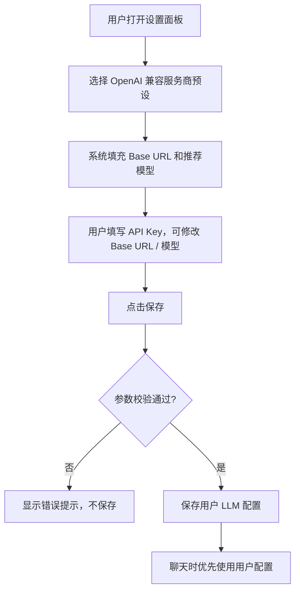

# OpenAI 兼容服务商预设配置 PRD v1.4.1

## 一、文档信息

| 项 | 内容 |
|----|------|
| 文档版本 | v1.4.1 |
| 创建日期 | 2026-06-14 |
| 需求阶段 | 开发前确认 |
| 优先级 | P1 |
| 所属路线 | v1.4 Web 对话页面 / Web 端配置页面增强 |

---

## 二、需求背景与目标

### 2.1 现状

OmniBot 已支持用户级 LLM 配置，用户可以保存 API Key、Base URL、模型名、Temperature、Max Tokens 等参数。后端已有 OpenAI API 兼容 Provider，能够按 `{base_url}/chat/completions` 调用符合 OpenAI 协议的模型服务。Web 设置面板也已有基础的 LLM 配置表单。

但当前 Web 端服务商配置存在两个问题：

1. 服务商展示和实际调用路由不一致，用户选择通义千问或豆包时，后端可能走专用 Provider，而不是 OpenAI-compatible 路由。
2. 国内主流服务商缺少清晰的 OpenAI-compatible 预设，用户需要自己查 Base URL 和模型名，配置门槛较高。
3. 专用 Provider 与 OpenAI-compatible Provider 的能力边界没有在界面上说明，容易让用户误以为所有服务商选项都已可用。

### 2.2 问题

1. **配置心智不清晰**：用户无法区分“OpenAI 兼容调用”和“厂商专用接口”。
2. **国内服务商接入成本高**：百度千帆、字节火山、阿里千问等服务商需要用户手动填写地址和模型。
3. **可用性预期不一致**：当前展示的专用 Provider 可能尚未满足 Web 端稳定可用要求，但界面未标注。

### 2.3 目标

> 让 Web 用户可以在 OpenAI 兼容模式下选择国内主流服务商预设，自动带出 Base URL 和推荐模型，并在保存后用于聊天对话。

本期目标聚焦 v1.4 Web 配置体验增强，不扩展到完整模型配置中心。

---

## 三、竞品分析

| 产品 | 实现方式 | 优点 | 缺点 |
|------|----------|------|------|
| Chatbox / Cherry Studio | 服务商预设 + 自定义 API 地址 | 配置直观，适合多服务商 | 需要持续维护服务商列表 |
| One API / New API | 统一 OpenAI-compatible 网关 | 接入模型范围广，调用协议统一 | 对普通用户来说配置项较技术化 |
| Dify | 模型供应商配置向导 | 引导完整，错误提示清晰 | 配置中心较重，不适合当前小迭代 |

### 我们的场景特殊性

OmniBot 的核心是“跨平台、有长期记忆、可自部署的智能助手”。本期不做大型模型市场，也不做复杂多租户配置中心，而是在已有 Web 设置面板中降低 OpenAI-compatible 配置门槛，保持最小改动和可自部署友好。

---

## 四、用户故事

| ID | 用户故事 | 优先级 | 实现版本 |
|----|----------|--------|----------|
| US001 | 作为 Web 用户，我想选择“OpenAI 兼容”模式，以便接入符合 OpenAI 协议的模型服务。 | P0 | v1.4.1 |
| US002 | 作为 Web 用户，我想选择百度千帆、字节火山、阿里千问等预设，以便不用手动查找默认 Base URL。 | P0 | v1.4.1 |
| US003 | 作为 Web 用户，我想在预设基础上修改 Base URL 和模型名，以便适配不同地域、账号或私有网关。 | P0 | v1.4.1 |
| US004 | 作为 Web 用户，我想看到专用 Provider 标注“暂不可用”，以便知道本期应该使用 OpenAI 兼容模式。 | P1 | v1.4.1 |
| US005 | 作为 Web 用户，我想保存配置后直接用于聊天，以便验证我的模型服务是否可用。 | P0 | v1.4.1 |
| US006 | 作为 Web 用户，我想点击“测试连接”，以便保存前确认 API Key / Base URL / 模型是否有效。 | P2 | v1.4.x |

---

## 五、迭代规划

| 版本 | 内容 | 说明 |
|------|------|------|
| **v1.4.1** | **OpenAI 兼容服务商预设配置** | 本期实现。支持服务商预设、保存配置、聊天使用配置；专用 Provider 展示但标注暂不可用。 |
| **v1.4.x** | **测试连接与错误诊断优化** | 后续增加测试连接按钮、错误原因提示、配置有效性检查。 |
| **v1.5+** | **统一配置中心增强** | 后续做多套模型配置、跨通道统一管理、专用 Provider 激活。 |

---

## 六、详细功能设计

### 6.1 调用模式与服务商分组

Web 设置面板中的 LLM 配置应按“调用模式”组织，而不是把所有服务商平铺展示。

界面结构：

```text
LLM 配置

调用模式 / 服务商

OpenAI 兼容（可用）
  ○ OpenAI 官方
  ○ 百度千帆
  ○ 字节火山
  ○ 阿里千问
  ○ 自定义 OpenAI-compatible

专用接口（暂不可用）
  ○ 百度千帆专用      [暂不可用]
  ○ 通义千问专用      [暂不可用]
  ○ 豆包专用          [暂不可用]

API Key
[ 输入 API Key ]

Base URL
[ 自动填充，可修改 ]

模型
[ 自动填充，可修改 ]

Temperature
[ 0.7 ]

Max Tokens
[ 2048 ]

[保存]
```

### 6.2 OpenAI 兼容预设

本期支持以下可用预设：

| 预设 | 展示名称 | 默认 Base URL | 推荐模型 | 是否可修改 |
|------|----------|---------------|----------|------------|
| openai | OpenAI 官方 | `https://api.openai.com/v1` | `gpt-4o-mini` | ✅ |
| baidu_qianfan | 百度千帆 | `https://qianfan.baidubce.com/v2` | `ernie-4.0-turbo-8k` | ✅ |
| volcengine | 字节火山 | `https://ark.cn-beijing.volces.com/api/v3` | `doubao-seed-1-6` | ✅ |
| aliyun_qwen | 阿里千问 | `https://dashscope.aliyuncs.com/compatible-mode/v1` | `qwen-plus` | ✅ |
| custom_openai_compatible | 自定义 OpenAI-compatible | 空，由用户填写 | 空，由用户填写 | ✅ |

说明：推荐模型用于降低首次配置门槛，不代表系统限制用户只能使用这些模型。

### 6.3 专用 Provider 展示

本期保留专用 Provider 的展示，但不可选择或选择后不能保存。

专用接口列表：

| 展示名称 | 状态 | 说明 |
|----------|------|------|
| 百度千帆专用 | 暂不可用 | 后续版本评估是否支持原生接口。 |
| 通义千问专用 | 暂不可用 | 当前推荐通过“OpenAI 兼容 → 阿里千问”使用。 |
| 豆包专用 | 暂不可用 | 当前推荐通过“OpenAI 兼容 → 字节火山”使用。 |

当用户查看专用接口时，界面应提示：

> 专用接口暂不可用。请先使用 OpenAI 兼容模式接入该服务商。

### 6.4 配置保存与聊天使用

保存流程：



聊天使用规则：

1. 用户已有有效配置时，聊天优先使用该用户配置。
2. 用户无配置时，继续使用系统默认模型。
3. 用户配置调用失败时，返回友好错误提示，不泄露内部错误细节。
4. 同步聊天和 SSE 流式聊天都应使用同一套用户配置选择逻辑。

### 6.5 表单校验与提示

| 字段 | 校验规则 | 错误提示 |
|------|----------|----------|
| API Key | 首次保存必填；长度 10-512 字符 | 请输入有效的 API Key。 |
| Base URL | OpenAI 兼容预设必填；必须以 `http://` 或 `https://` 开头 | API 地址必须以 http:// 或 https:// 开头。 |
| Model | 必填；长度不超过 128 字符 | 请输入模型名称。 |
| Temperature | 0 到 2 | 温度参数必须在 0-2 之间。 |
| Max Tokens | 1 到 128000 | Max Tokens 超出范围。 |
| 专用接口 | 暂不可保存 | 专用接口暂不可用，请使用 OpenAI 兼容模式。 |

---

## 七、数据模型（产品层面）

本期复用已有用户 LLM 配置，不引入多配置表。

| 字段 | 说明 | 必填 | 默认值 |
|------|------|------|--------|
| 用户标识 | 配置所属用户 | ✅ | - |
| 调用模式 | 本期固定为 OpenAI 兼容或暂不可用专用接口展示 | ✅ | OpenAI 兼容 |
| 服务商预设 | OpenAI 官方 / 百度千帆 / 字节火山 / 阿里千问 / 自定义 | ✅ | OpenAI 官方 |
| API Key | 用户的模型服务密钥，加密存储 | ✅ | - |
| Base URL | OpenAI-compatible API 基础地址 | ✅ | 由预设带出 |
| 模型名 | 请求时使用的模型名称 | ✅ | 由预设带出 |
| Temperature | 生成随机性参数 | ❌ | 0.7 |
| Max Tokens | 最大输出 token 数 | ❌ | 2048 |
| 配置状态 | 是否正在使用用户配置 | ✅ | 正常 |

---

## 八、异常与边界处理

| 场景 | 处理方式 |
|------|----------|
| 用户首次保存但未填写 API Key | 阻止保存，提示“请输入有效的 API Key”。 |
| 用户选择自定义 OpenAI-compatible 但未填写 Base URL | 阻止保存，提示“请输入 API 地址”。 |
| 用户选择专用接口 | 不允许保存，提示专用接口暂不可用。 |
| 用户切换服务商预设 | 自动更新 Base URL 和推荐模型；如果用户已手动修改过字段，需要提示会覆盖当前填写。 |
| 用户编辑已有配置但 API Key 留空 | 保留原 API Key，仅更新其他字段。 |
| 用户配置调用失败 | 返回友好错误：“模型调用失败，请检查 API Key、Base URL 或模型名称。” |
| 用户清除配置 | 删除用户配置，后续聊天恢复系统默认模型。 |
| 服务商预设地址未来变化 | 通过后续小版本更新预设，不影响用户手动填写的自定义地址。 |

---

## 九、非功能需求

| 项 | 要求 | 说明 |
|----|------|------|
| 安全 | API Key 必须加密存储、脱敏展示 | 继续遵守 AES-256-GCM 加密规范。 |
| 日志 | 不得输出 API Key、完整用户消息内容 | 只记录 provider、状态、错误类型等非敏感元数据。 |
| 兼容性 | 不破坏现有用户配置 | 已保存的 openai/qwen/doubao 配置需要可迁移或继续可读。 |
| 可用性 | 无配置用户不受影响 | 继续使用系统默认模型。 |
| 性能 | 配置读取不明显增加聊天延迟 | 维持当前用户配置查询路径，不引入远程依赖。 |
| 可维护性 | 服务商预设应集中维护 | 避免前后端各自散落硬编码导致不一致。 |

---

## 十、验收标准

- [ ] 设置面板展示“OpenAI 兼容（可用）”与“专用接口（暂不可用）”两个分组。
- [ ] 用户选择“OpenAI 兼容 → 百度千帆”时，自动填充百度千帆默认 Base URL 和推荐模型。
- [ ] 用户选择“OpenAI 兼容 → 字节火山”时，自动填充字节火山默认 Base URL 和推荐模型。
- [ ] 用户选择“OpenAI 兼容 → 阿里千问”时，自动填充阿里千问默认 Base URL 和推荐模型。
- [ ] 用户选择“自定义 OpenAI-compatible”时，可以手动填写 Base URL 和模型。
- [ ] 用户可以修改预设带出的 Base URL 和模型名后保存。
- [ ] 用户首次保存配置时必须填写 API Key。
- [ ] 用户编辑已有配置时 API Key 可留空，并保留原 API Key。
- [ ] 专用接口选项显示“暂不可用”，且不能保存为有效配置。
- [ ] 保存成功后，同步聊天接口使用用户的 OpenAI-compatible 配置。
- [ ] 保存成功后，SSE 流式聊天接口使用用户的 OpenAI-compatible 配置。
- [ ] 配置调用失败时，用户看到友好错误提示，不暴露内部堆栈或敏感信息。
- [ ] 清除配置后，聊天恢复使用系统默认模型。
- [ ] 已有无配置用户继续正常使用系统默认模型。

---

## 十一、对当前项目的影响

### 需要新增/修改的模块

| 模块 | 影响 |
|------|------|
| Web 设置面板 | 调整服务商选择结构，增加 OpenAI 兼容预设和专用接口暂不可用标识。 |
| 前端配置类型 | 增加服务商预设标识或调用模式字段的表达。 |
| 用户 LLM 配置 API | 校验服务商预设，保存 OpenAI-compatible 配置。 |
| LLM 配置服务 | 明确 OpenAI-compatible 路由选择，避免 qwen/doubao 预设误走专用 Provider。 |
| LLM 客户端工厂 | 用户级 OpenAI-compatible 配置统一走 OpenAIProvider。 |
| 文档 | 更新 PRD、架构文档和测试计划。 |

### 不影响的模块

| 模块 | 说明 |
|------|------|
| 微信接入验证 | 不改微信公众号回调协议。 |
| 用户体系 | 不新增用户模型。 |
| 长期记忆 | 不改记忆模型和记忆管理流程。 |
| 消息存储 | 不改消息表结构。 |
| 系统默认 LLM 配置 | 无用户配置时继续使用系统默认配置。 |

---

## 十二、风险与应对

| 风险 | 影响 | 应对措施 |
|------|------|----------|
| 国内服务商 OpenAI-compatible 地址或模型名变化 | 中 | 预设只作为默认值，允许用户手动覆盖。 |
| 用户误选专用接口 | 低 | 专用接口分组标注暂不可用，禁用保存。 |
| 前后端预设不一致 | 中 | 预设定义集中维护，并通过接口或共享常量保证一致。 |
| API Key 错误导致聊天失败 | 中 | 本期提供友好错误，测试连接放入 v1.4.x。 |
| 旧配置 provider 值与新预设不匹配 | 中 | 保留兼容读取逻辑，旧配置继续展示为可编辑配置。 |
| 日志泄露敏感信息 | 高 | 严格禁止记录 API Key 和完整用户消息内容。 |

---

## 十三、后续规划

### v1.4.x：测试连接

后续增加“测试连接”按钮，用一条轻量模型请求验证 API Key、Base URL 和模型名是否可用，并将错误归因到 Key、地址、模型或网络问题。

### v1.5+：统一模型配置中心

后续在统一配置中心支持：

1. 多套模型配置。
2. 默认模型选择。
3. 不同通道使用不同模型策略。
4. 专用 Provider 正式启用。
5. 更完整的模型服务商管理。
