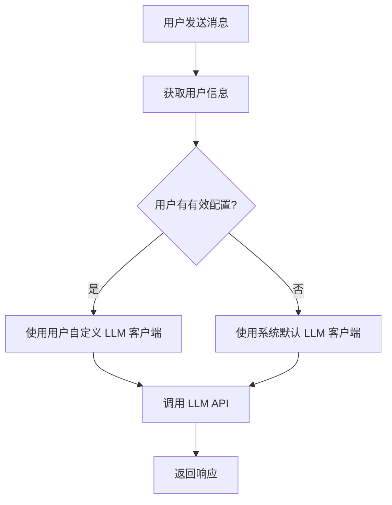

# 用户自定义 LLM 配置接口对接 PRD

> **版本**: v1.0  
> **创建日期**: 2026-05-20  
> **状态**: 待评审  

---

## 1. 需求概述

### 1.1 背景

当前 OmniBot 前端已实现完整的用户设置面板，支持用户配置自定义 LLM 模型参数（服务商、模型、API Key、Base URL 等）。但前端目前仅调用系统级配置接口（`/api/v1/config`），缺乏与后端用户级配置的对接。

后端已实现用户 LLM 配置的领域模型、仓储层和服务层，但缺少面向 Web 前端的 API 接口。

本需求旨在完成前后端用户配置接口的对接，实现用户级 LLM 配置的持久化存储和使用。

### 1.2 目标

- 实现用户级 LLM 配置的 CRUD API 接口
- 前端设置面板与后端接口对接
- 配置数据加密存储，保障用户数据安全
- 用户聊天时优先使用自定义配置

### 1.3 范围

| 模块 | 包含 | 说明 |
|------|------|------|
| 后端 API | ✅ | 用户 LLM 配置增删改查接口 |
| 前端对接 | ✅ | 设置面板与 API 对接 |
| 聊天注入 | ✅ | 聊天时使用用户自定义配置 |
| 多租户隔离 | ✅ | 用户间配置数据隔离 |
| 服务商扩展 | ❌ | 本期不新增服务商支持 |

---

## 2. 用户故事

### US-1: 保存 LLM 配置

**作为** 一个 Web 用户  
**我想要** 在设置面板保存我的 LLM API 配置  
**以便** 使用我自己的账号进行对话

**验收标准**:
- [ ] 输入 API Key、Base URL、模型等参数后点击保存，数据持久化到后端
- [ ] 保存成功后有明确提示
- [ ] 刷新页面后配置仍然存在
- [ ] API Key 加密存储，不在日志和响应中明文显示

### US-2: 查看已保存的配置

**作为** 一个 Web 用户  
**我想要** 在设置面板看到我已保存的配置状态  
**以便** 确认配置是否正确

**验收标准**:
- [ ] 进入设置面板后自动加载已保存的配置
- [ ] API Key 显示为脱敏格式（`sk-xxx...xx`）
- [ ] 显示当前使用状态（"使用自定义模型" / "使用系统默认模型"）

### US-3: 聊天使用自定义配置

**作为** 一个已配置 LLM 的用户  
**我想要** 聊天时使用我自己的配置  
**以便** 获得个性化的服务

**验收标准**:
- [ ] 发送消息时，后端优先使用用户的自定义 LLM 配置
- [ ] 如用户未配置或配置无效，自动降级使用系统默认配置
- [ ] 用户可感知到使用的是自己的配置（例如响应速度、模型行为）

### US-4: 清除配置

**作为** 一个 Web 用户  
**我想要** 清除我已保存的 LLM 配置  
**以便** 恢复使用系统默认配置

**验收标准**:
- [ ] 设置面板有"清除配置"按钮
- [ ] 点击后清除用户所有 LLM 配置数据
- [ ] 清除后聊天自动使用系统默认配置

---

## 3. 功能需求

### 3.1 后端 API 设计

#### 3.1.1 获取用户配置

**接口**: `GET /api/v1/user/llm-config`

**请求参数**:
```
session_id: string (query param, 必需) - 用户会话标识
```

**响应**:
```json
{
  "success": true,
  "data": {
    "has_config": true,
    "api_key_masked": "sk-abc...de",
    "base_url": "https://api.openai.com/v1",
    "model": "gpt-3.5-turbo",
    "provider": "openai",
    "status_text": "使用你的自定义模型"
  }
}
```

**字段说明**:
| 字段 | 类型 | 说明 |
|------|------|------|
| has_config | boolean | 用户是否有有效配置 |
| api_key_masked | string | 脱敏后的 API Key |
| base_url | string | API 地址（has_config=true 时有值） |
| model | string | 模型名（has_config=true 时有值） |
| provider | string | 服务商标识 |
| status_text | string | 状态描述文本 |

#### 3.1.2 更新用户配置

**接口**: `PUT /api/v1/user/llm-config`

**请求体**:
```json
{
  "session_id": "xxx",
  "provider": "openai",
  "model": "gpt-3.5-turbo",
  "api_key": "sk-xxxxxxxxxxxx",
  "base_url": "https://api.openai.com/v1",
  "temperature": 0.7,
  "max_tokens": 2048
}
```

**字段说明**:
| 字段 | 类型 | 必填 | 说明 |
|------|------|------|------|
| session_id | string | 是 | 用户会话标识 |
| provider | string | 是 | 服务商：openai/anthropic/azure/qwen/doubao |
| model | string | 是 | 模型名 |
| api_key | string | 是 | API Key（明文传输，HTTPS 加密） |
| base_url | string | 否 | 自定义 API 地址 |
| temperature | number | 否 | 温度参数 (0-2) |
| max_tokens | number | 否 | 最大 Token 数 |

**响应**:
```json
{
  "success": true,
  "message": "配置保存成功"
}
```

**错误响应**:
```json
{
  "success": false,
  "error": "API Key 格式不正确"
}
```

#### 3.1.3 删除用户配置

**接口**: `DELETE /api/v1/user/llm-config`

**请求参数**:
```
session_id: string (query param, 必需)
```

**响应**:
```json
{
  "success": true,
  "message": "配置已清除"
}
```

### 3.2 聊天流程改造

当前流程：
1. 用户发送消息
2. 后端使用全局 LLM 配置调用 API
3. 返回响应

改造后流程：


### 3.3 前端功能点

1. **设置面板加载时**：调用 `GET /api/v1/user/llm-config` 获取配置，反写到表单
2. **保存时**：调用 `PUT /api/v1/user/llm-config`，成功后提示，失败显示错误信息
3. **清除配置**：新增"清除配置"按钮，点击后调用 `DELETE /api/v1/user/llm-config`
4. **状态展示**：显示当前使用的是自定义配置还是系统默认

---

## 4. 非功能需求

### 4.1 安全需求

| 需求 | 说明 |
|------|------|
| 数据加密 | API Key 在数据库中必须加密存储（AES-256），不能明文保存 |
| 传输安全 | 所有 API 调用必须通过 HTTPS 传输 |
| 数据隔离 | 用户只能访问自己的配置，不能越权访问他人配置 |
| 脱敏展示 | API Key 在前端和日志中必须脱敏显示（仅显示前后几位） |
| 日志安全 | 日志中禁止输出完整 API Key、用户消息内容等敏感信息 |

### 4.2 性能需求

| 需求 | 指标 |
|------|------|
| 配置加载 | 获取配置接口响应时间 < 50ms |
| 配置保存 | 保存配置接口响应时间 < 100ms |
| 并发 | 支持 100+ 用户同时使用各自配置 |

### 4.3 可靠性需求

| 需求 | 说明 |
|------|------|
| 降级机制 | 用户配置无效（解密失败、API Key 错误等）时，自动降级使用系统默认配置，不影响用户使用 |
| 错误提示 | 配置验证失败时，给出明确、友好的错误提示 |
| 幂等性 | 重复调用保存接口结果一致 |

---

## 5. 数据模型

### 5.1 现有领域模型（后端）

```go
type LLMConfig struct {
    ID        int64
    UserID    int64     // 用户 ID，唯一索引
    APIKey    string    // 加密后存储
    BaseURL   *string   // 可选
    Model     *string   // 可选
    Status    int8      // 0-正常, 1-禁用
    CreatedAt time.Time
    UpdatedAt time.Time
}
```

### 5.2 需要扩展的字段

| 新增字段 | 类型 | 说明 |
|----------|------|------|
| Provider | string | 服务商标识（openai/qwen/doubao 等） |
| Temperature | *float64 | 温度参数 |
| MaxTokens | *int | 最大 Token 数 |

### 5.3 前端数据模型（现有）

```typescript
interface LLMConfig {
  provider: string;      // 服务商
  model: string;         // 模型
  apiKey?: string;       // API Key（仅保存时存在）
  baseUrl?: string;      // Base URL
  temperature?: number;  // 温度
  maxTokens?: number;    // 最大 Token
}
```

### 5.4 字段映射

| 前端字段 | 后端字段 | 说明 |
|----------|----------|------|
| provider | Provider | 服务商标识 |
| model | Model | 模型名 |
| apiKey | APIKey | 加密存储，前端仅接收不返回明文 |
| baseUrl | BaseURL | API 地址 |
| temperature | Temperature | 采样温度 |
| maxTokens | MaxTokens | 最大生成长度 |

---

## 6. 接口详细设计

### 6.1 认证机制

当前 Web 端使用 `session_id` 作为用户唯一标识：
- 首次访问时生成 UUID 存储在 localStorage
- 每次请求携带 `session_id` 参数
- 后端通过 `GetOrCreateByChannel("web", session_id)` 获取/创建用户

### 6.2 接口列表

| 序号 | 方法 | 路径 | 功能 |
|------|------|------|------|
| 1 | GET | `/api/v1/user/llm-config` | 获取用户 LLM 配置 |
| 2 | PUT | `/api/v1/user/llm-config` | 更新用户 LLM 配置 |
| 3 | DELETE | `/api/v1/user/llm-config` | 删除用户 LLM 配置 |

### 6.3 接口实现位置

- **路由注册**: `internal/api/routes.go` - 新增 user 配置相关路由组
- **Handler 实现**: `internal/api/web/handler.go` - 新增配置相关 Handler 方法
- **服务层**: `internal/service/user/llm_config_service.go` - 扩展现有服务

---

## 7. 技术实现方案

### 7.1 后端实现步骤

1. **扩展领域模型**: `internal/domain/user/llm_config.go` 增加 Provider、Temperature、MaxTokens 字段
2. **扩展服务层**: `internal/service/user/llm_config_service.go` 增加 UpdateFullConfig 方法，支持批量更新
3. **新增 Handler 方法**: 在 web handler 中新增 GetLLMConfig、UpdateLLMConfig、DeleteLLMConfig 方法
4. **注册路由**: 在 `routes.go` 中注册新接口
5. **聊天注入改造**: 修改 `HandleSendMessage` 方法，优先使用用户配置创建 LLM 客户端

### 7.2 前端实现步骤

1. **扩展 API Service**: `src/services/config.ts` 新增用户配置相关接口方法
2. **修改 Store**: `src/stores/settings.ts` 对接新的用户配置 API
3. **更新设置面板**: `SettingsPanel.vue` 增加"清除配置"按钮，调整加载和保存逻辑
4. **错误处理**: 完善保存失败时的错误提示

### 7.3 LLM 客户端动态创建

```go
// HandleSendMessage 中
user, _, _, err := h.userService.GetOrCreateByChannel("web", req.SessionID)

// 尝试使用用户自定义配置
apiKey, baseURL, model, hasCustom, err := h.llmConfigService.GetConfigForUser(user.ID)
if err == nil && hasCustom {
    // 使用用户配置创建 LLM 客户端
    customConfig := llm.Config{
        Provider:  provider, // 从用户配置解析
        APIKey:    apiKey,
        BaseURL:   baseURL,
        Model:     model,
    }
    customClient, err := llm.NewClient(customConfig)
    if err == nil {
        // 使用自定义客户端调用
        response, err = customClient.ChatCompletion(...)
    }
    // 失败则降级使用默认客户端
}

// 降级：使用系统默认客户端
if response == "" {
    response, err = h.llmClient.ChatCompletion(...)
}
```

---

## 8. 测试用例

### 8.1 接口测试

| 用例 | 输入 | 预期输出 |
|------|------|----------|
| 新用户获取配置 | 有效 session_id | has_config=false，提示使用系统默认 |
| 保存有效配置 | 正确的 API Key 格式 | success=true |
| 保存无效 API Key | "invalid-key"（非 sk- 开头） | 返回格式错误提示 |
| 保存超长 API Key | > 200 字符 | 返回长度错误提示 |
| 更新配置 | 已存在配置，修改模型 | 配置成功更新 |
| 删除配置 | 有效 session_id | 配置被清除，has_config=false |
| 越权访问 | 使用他人 session_id | 只能访问自己的配置（通过 session 保证） |

### 8.2 集成测试

| 用例 | 步骤 | 预期 |
|------|------|------|
| 配置后聊天 | 1. 保存自定义配置<br>2. 发送消息 | 消息使用用户配置的 LLM 服务 |
| 配置清除后聊天 | 1. 清除配置<br>2. 发送消息 | 自动降级使用系统默认配置 |
| 配置过期 | 1. 保存无效 API Key<br>2. 发送消息 | 降级使用系统默认，不报错 |

### 8.3 安全测试

| 用例 | 预期 |
|------|------|
| 数据库查看 | API Key 字段为加密字符串，无法直接读取 |
| 接口响应 | 不返回完整 API Key，仅返回脱敏格式 |
| 日志检查 | 日志中不输出用户 API Key 和消息内容 |

---

## 9. 验收标准

### 9.1 功能验收

- [ ] 用户可以成功保存 LLM 配置
- [ ] 已保存的配置在刷新页面后仍然存在
- [ ] API Key 在前端和后端日志中都是脱敏显示
- [ ] 聊天时使用用户自定义配置的 LLM 服务
- [ ] 用户配置无效时自动降级使用系统默认，不影响聊天
- [ ] 用户可以清除配置恢复使用系统默认

### 9.2 质量验收

- [ ] 所有接口有单元测试覆盖
- [ ] 核心流程有集成测试
- [ ] 代码通过静态检查和 Lint
- [ ] 无 SQL 注入、越权等安全漏洞
- [ ] 接口响应时间满足性能指标

---

## 10. 开发任务拆解

### 10.1 后端任务

| 任务 | 预估工时 | 负责人 |
|------|----------|--------|
| 1. 扩展 LLMConfig 领域模型，增加 Provider/Temperature/MaxTokens | 0.5h | |
| 2. 扩展 LLMConfigService，支持完整配置更新 | 1h | |
| 3. 新增 web handler 配置相关方法 | 1.5h | |
| 4. 注册路由 | 0.5h | |
| 5. 改造 HandleSendMessage，支持用户配置注入 | 1.5h | |
| 6. 编写单元测试 | 2h | |
| 7. 编写集成测试 | 1h | |

**后端小计**: 8h

### 10.2 前端任务

| 任务 | 预估工时 | 负责人 |
|------|----------|--------|
| 1. 扩展 config service，对接用户配置 API | 1h | |
| 2. 修改 settings store，对接新接口 | 1h | |
| 3. SettingsPanel 增加清除配置按钮和状态展示 | 1h | |
| 4. 错误处理和用户提示优化 | 0.5h | |
| 5. 前端联调测试 | 1h | |

**前端小计**: 4.5h

### 10.3 总工作量

**总计**: 12.5h 人天

---

## 11. 风险与缓解

| 风险 | 影响 | 概率 | 缓解措施 |
|------|------|------|----------|
| 用户 API Key 解密失败导致聊天报错 | 高 | 中 | 完善降级机制，解密失败时自动使用系统默认，记录警告日志 |
| 并发场景下 LLM 客户端创建性能问题 | 中 | 低 | 考虑客户端缓存池，避免每次请求重新创建 |
| 字段扩展导致数据库迁移问题 | 中 | 低 | 编写安全的 migration 脚本，测试环境先行 |
| 前端旧数据兼容 | 中 | 低 | 做好字段默认值，保证旧版本也能正常工作 |

---

## 12. 附录

### 12.1 相关文档

- [系统设计总览](../30-服务架构/00-系统设计总览.md)
- [用户系统设计](../superpowers/plans/2026-05-07-user-system.md)
- [用户自定义 LLM 配置方案](../superpowers/plans/2026-05-09-用户自定义LLM配置.md)

### 12.2 代码位置

| 模块 | 路径 |
|------|------|
| 后端领域模型 | `internal/domain/user/llm_config.go` |
| 后端服务层 | `internal/service/user/llm_config_service.go` |
| 后端 API Handler | `internal/api/web/handler.go` |
| 路由注册 | `internal/api/routes.go` |
| 前端设置面板 | `frontend/src/components/functional/SettingsPanel.vue` |
| 前端配置服务 | `frontend/src/services/config.ts` |
| 前端状态管理 | `frontend/src/stores/settings.ts` |

---

**文档结束**
